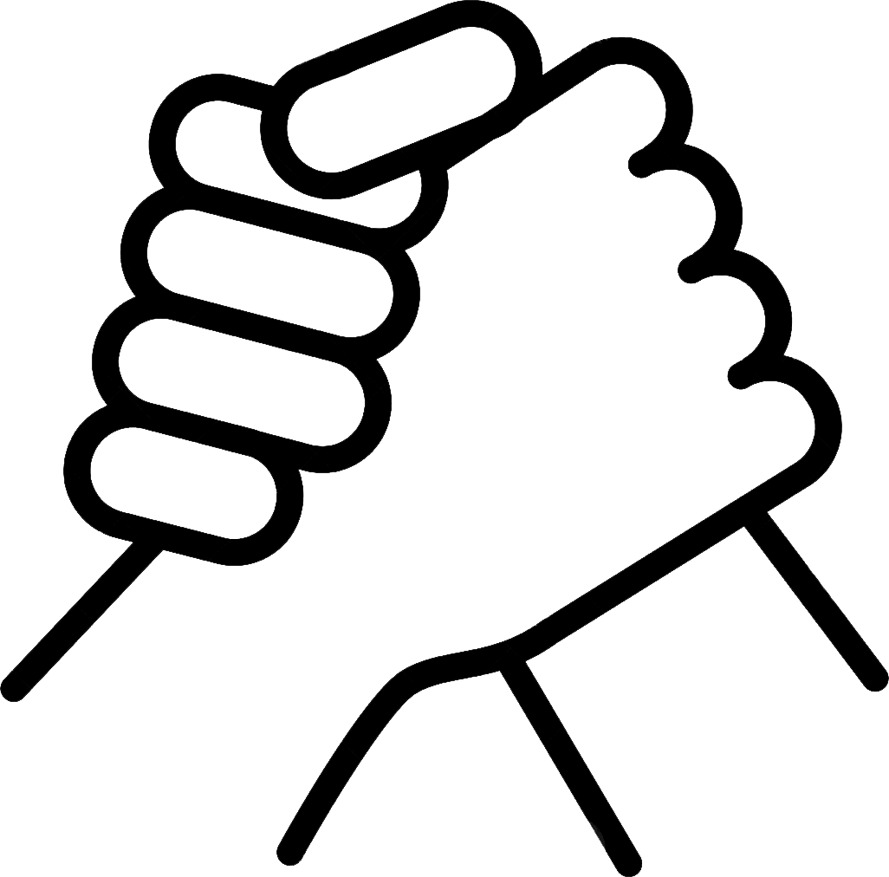

# SolidariedadeConnect
### Aplicativo Mobile de Cadastro de Pessoas Carentes para Programa Social

**Contratante**: Governo Federal
**Dono**: Sierra
**N° Funcionários**: X

## Sobre o Projeto

**Prazo máximo de entrega**: 60 dias

**Linguagens permitidas**: JavaScript, Python (Flask ou Django), React, React Native, MySQL ou Node

**Entrega**: Arquivo em .ZIP contendo todas as páginas HTML, imagens e outros recursos necessários para execução local.

### Objetivo

O *SolidariedadeConnect* é um aplicativo mobile projetado para simplificar o processo de cadastro de pessoas carentes em programas sociais. Este aplicativo coleta informações dos inscritos e as armazena de forma segura em um banco de dados. Além disso, ele possui a capacidade de gerar arquivos PDF contendo as informações dos inscritos, facilitando a gestão do programa.

### Requisitos Funcionais

#### 1. Cadastro de Usuário

- Os usuários podem se cadastrar fornecendo informações pessoais, como nome completo, idade, gênero, endereço e número de identificação, quando aplicável.
- A criação de uma conta usando credenciais de acesso (por exemplo, e-mail e senha) é suportada para que os usuários possam acessar o aplicativo posteriormente.

#### 2. Coleta de Dados

- O aplicativo fornece um formulário de inscrição com campos intuitivos para coletar informações detalhadas sobre a situação socioeconômica dos inscritos, como renda familiar, número de membros da família, despesas mensais e nível de escolaridade.

#### 3. Armazenamento de Dados

- Os dados coletados dos inscritos são armazenados de forma segura em um banco de dados, garantindo a privacidade e proteção das informações pessoais.
- Medidas de segurança robustas são implementadas para proteger os dados contra acesso não autorizado.

#### 4. Geração de PDF

- O aplicativo possui a capacidade de gerar arquivos PDF formatados de maneira clara e organizada, contendo todas as informações fornecidas pelos inscritos durante o cadastro.
- Isso permite a impressão ou compartilhamento fácil dos documentos gerados.

#### 5. Gerenciamento de Inscrições

- Os administradores do programa social têm acesso a uma interface de gerenciamento de inscrições que permite visualizar, editar e aprovar as inscrições.
- É possível pesquisar e filtrar inscrições com base em critérios específicos para facilitar a análise e tomada de decisões.

### Requisitos Não Funcionais

#### 1. Interface de Usuário Intuitiva

- A interface do aplicativo é projetada para ser intuitiva e de fácil utilização, levando em consideração a possível falta de familiaridade dos usuários com dispositivos móveis.

#### 2. Disponibilidade Offline

- O aplicativo é capaz de funcionar offline, permitindo que os usuários preencham o formulário de inscrição mesmo sem conexão à internet. Os dados são sincronizados automaticamente quando a conexão é restabelecida.

#### 3. Compatibilidade

- O aplicativo é desenvolvido para ser compatível com os principais sistemas operacionais móveis, como Android e iOS.

#### 4. Segurança

- São implementadas práticas rigorosas de criptografia e autenticação para garantir a segurança dos dados armazenados.

#### 5. Escalabilidade

- O sistema é projetado para lidar com um grande número de inscrições e é escalável, permitindo o crescimento do programa social no futuro.

## Prazo de Entrega

O prazo de entrega estimado para o desenvolvimento completo do aplicativo é de **90 dias**, considerando a complexidade dos requisitos e a necessidade de testes e ajustes.

## Nota Final

Este README fornece uma visão geral do aplicativo *SolidariedadeConnect*, destacando seus objetivos, requisitos funcionais e não funcionais. Detalhes específicos de design, recursos adicionais e aspectos técnicos serão discutidos em reuniões subsequentes para garantir uma compreensão completa das necessidades e expectativas do projeto.

Para mais informações, entre em contato conosco em [inserir email de contato aqui]. Agradecemos o seu interesse no *SolidariedadeConnect* e esperamos colaborar para criar um impacto positivo na sociedade.
